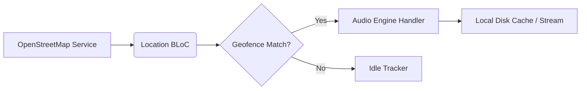
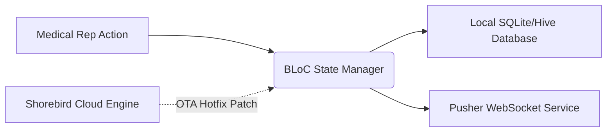
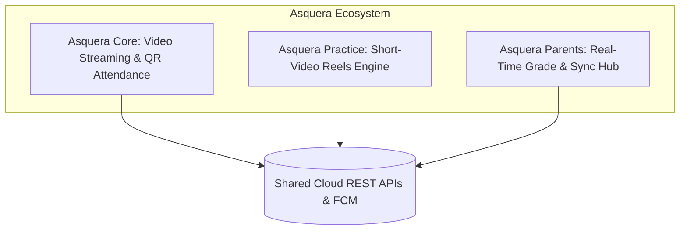
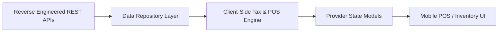
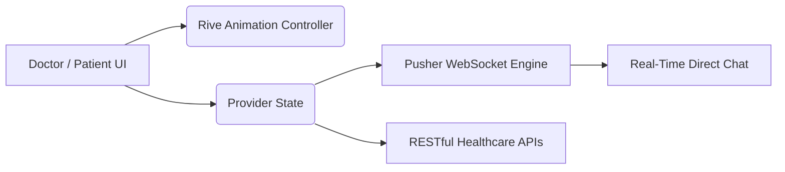
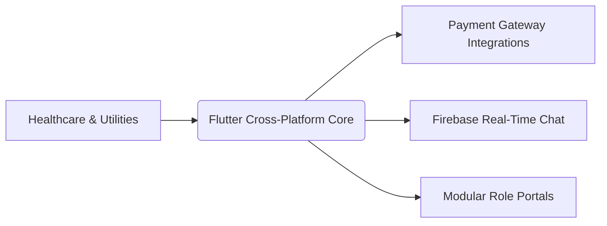

# Hi, I'm Ahmed Nasser 👋
### Senior Flutter Engineer | Cross-Platform Systems & Clean Architecture

- 💼 **LinkedIn:** [linkedin.com/in/ahmednasser7797](https://www.linkedin.com/in/ahmednasser7797/)
- 📧 **Email:** [a.nasser9600@gmail.com](mailto:a.nasser9600@gmail.com)
- 📞 **Phone:** [+20 127 581 9235](tel:+201275819235)
- 💬 **WhatsApp:** [Chat on WhatsApp](https://wa.me/201275819235)
- 📍 **Location:** Alexandria, Egypt

---

## 🚀 Technical Arsenal

- **Core & Languages:** Flutter, Dart, Kotlin, Jetpack Compose
- **Architecture:** Clean Architecture, Feature-First, Dependency Injection (SOLID)
- **State Management:** BLoC / Cubit, Provider
- **Real-Time & Sync:** Pusher WebSockets, Firebase (Auth, Cloud Messaging, Firestore)
- **DevOps & Releases:** Shorebird OTA, Codemagic, App Store Connect, Google Play Console
- **Local Persistence:** Hive, SQLite

---

## 📱 Featured Engineering Case Studies

### 1. 🎧 Rafeek — Cross-Platform Audio Tour Guide
> Location-aware walking companion with real-time landmark tracking and background media playback.

- **Architecture:** Clean Architecture + BLoC
- **Core Challenge:** Streaming audio without interruption while fetching dynamic points of interest via OpenStreetMap in low-connectivity areas.
- **Engineering Solution:** Built an offline caching layer that pre-fetches audio and guides while throttling GPS pings to preserve device battery life.
- **Live Links:** [Official Website](https://rafeek.app/)
- [Google Play Link](https://play.google.com/store/apps/details?id=app.rafeek.tech)
- [App Store Link](https://apps.apple.com/us/app/rafeek-audio-guide/id6757149536)

---

### 2. 🏥 Bepharma — Enterprise Pharmaceutical CRM
> Field-force automation tool for medical representatives with real-time synchronization.

- **Architecture:** Clean Architecture + BLoC
- **Core Challenge:** Eliminating app store review delays during critical production bug fixes while handling high-throughput offline/online data syncing.
- **Engineering Solution:** Re-architected core modules using BLoC for a **70% performance improvement** (boosting logged visits by **68%**) and integrated **Shorebird OTA** for instant over-the-air hotfixes.
- **Live Links:** [Google Play](https://play.google.com/store/apps/details?id=com.bepharma)

---

### 3. 🎓 Asquera — Three-Tier Educational Ecosystem
> Scaled multi-platform ecosystem serving over 3,000 students, teachers, and parents in Egypt.

- **Architecture:** Clean Architecture + Provider + Hive Local Storage
- **Core Challenge:** Orchestrating 3 separate roles (students, teachers, and parents) with real-time grade updates and heavy media playback.
- **Engineering Solution:** Split functionality into modular apps with dedicated data synchronization pipelines and a reels-based gamification engine.

**Ecosystem Apps & Live Links:**
- **Asquera Core (Student & Admin):** Video lecture streaming, online exams, and offline QR-based attendance tracking.  
  👉 [Google Play](https://play.google.com/store/apps/details?id=com.revoid.asquera)
- **Asquera Practice (Gamification):** Short-video reel feed with automated daily leaderboard contests.  
  👉 [Google Play](https://play.google.com/store/apps/details?id=com.rovoid.asquera.practice) • [App Store](https://apps.apple.com/us/app/asquera-practice/id6757539057)
- **Asquera Parents (Monitoring Hub):** Real-time sync for academic scores, attendance logs, and payment tracking.  
  👉 [Google Play](https://play.google.com/store/apps/details?id=com.rovoid.asquera.parent) • [App Store](https://apps.apple.com/us/app/asquera-parents/id6757544935)

---

### 4. 💼 Finiex — Enterprise ERP Mobile Client
> Digital conversion of an enterprise desktop/web ERP suite into a mobile application.

- **Architecture:** Clean Architecture + Provider
- **Core Challenge:** Migrating an undocumented desktop system with complex accounting rules directly onto mobile devices.
- **Engineering Solution:** Reverse-engineered network packets to build typed REST contracts and implemented an offline client-side calculation engine for instant tax, POS, and invoice generation.
- **Core Modules:** Inventory, POS, Sales, Purchasing, and Multi-role Vendor Management.
- **Preview:** [▶ Watch Demo Video](https://drive.google.com/file/d/18OOumEqpP-MS0BWumWaackTklDj7CbDV/view)

---

### 5. 🩺 Consolto — Medical Social & Consultation Platform
> Interactive community network connecting patients and doctors with appointment scheduling.

- **Architecture:** Clean Architecture + Provider
- **Core Challenge:** Delivering fluid, responsive user feedback during consultations and instant two-way doctor-patient messaging without UI latency.
- **Engineering Solution:** Integrated **Rive vector animations** for smooth dynamic states and coupled **Pusher WebSockets** with background REST synchronization for low-latency live consultations.
- **Live Links:** [App Store](https://apps.apple.com/us/app/consolto/id6475204243) • [Google Play](https://play.google.com/store/apps/details?id=com.app.consolto)

---

### 6. 📦 Additional Shipped Apps

- **Baltoe:** Arabic healthcare community network with **10,000+ downloads**.
- **FoundDr:** Dual-portal hospital management platform with distinct workflows for doctors and patients.
- **Omlah Exchange:** Currency exchange application featuring one-tap rate conversion and payment gateway integration.
- **Mahlolah & Mega Academy:** Craftsmen marketplace and modular e-learning platform with integrated exams and Firebase chat.

---

## 📬 Connect With Me

- **LinkedIn:** [linkedin.com/in/ahmednasser7797](https://www.linkedin.com/in/ahmednasser7797/)
- **Email:** [a.nasser9600@gmail.com](mailto:a.nasser9600@gmail.com)
- **Phone:** [+20 127 581 9235](tel:+201275819235)
- **WhatsApp:** [Chat on WhatsApp](https://wa.me/201275819235)
- **Location:** Alexandria, Egypt
