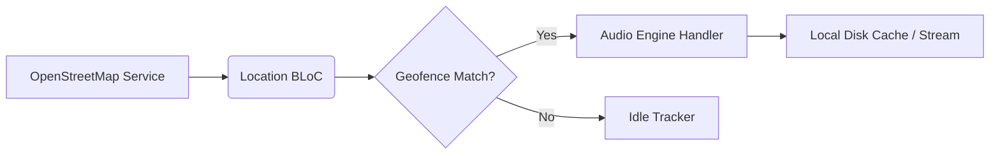
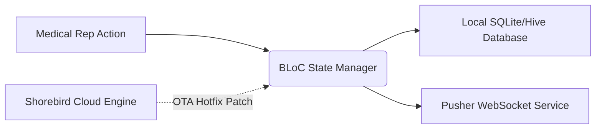
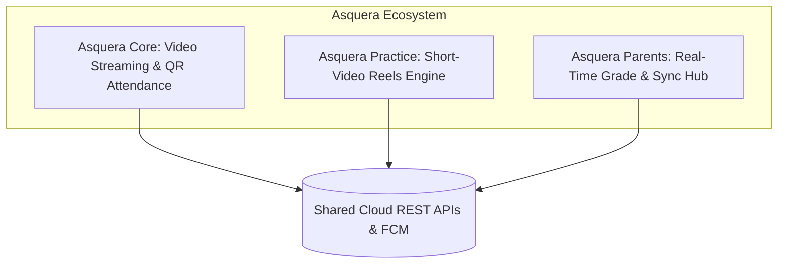
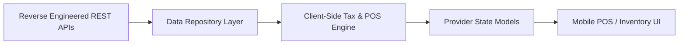
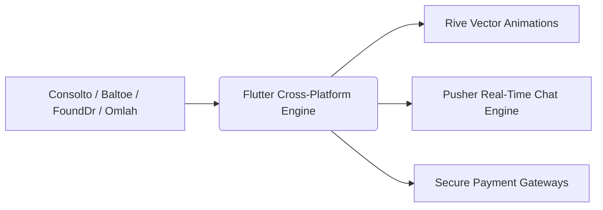

# Hi, I'm Ahmed Nasser 👋
### Senior Flutter Engineer | Cross-Platform Systems & Clean Architecture

  
  
  

---

## 🚀 Technical Arsenal

- **Core & Languages:** Flutter, Dart, Kotlin, Jetpack Compose[cite: 1]
- **Architecture:** Clean Architecture, Feature-First, Dependency Injection (SOLID)[cite: 1]
- **State Management:** BLoC / Cubit, Provider[cite: 1]
- **Real-Time & Sync:** Pusher WebSockets, Firebase (Auth, Cloud Messaging, Firestore)[cite: 1]
- **DevOps & Releases:** Shorebird OTA, Codemagic, App Store Connect, Google Play Console[cite: 1]
- **Local Persistence:** Hive, SQLite[cite: 1]

---

## 📱 Featured Engineering Case Studies

### 1. 🎧 Rafeek — Cross-Platform Audio Tour Guide
> Location-aware walking companion with real-time landmark tracking and background media playback[cite: 1].

- **Architecture:** Clean Architecture + BLoC[cite: 1].
- **Core Challenge:** Streaming audio without interruption while fetching dynamic points of interest via OpenStreetMap in low-connectivity areas[cite: 1].
- **Engineering Solution:** Built an offline caching layer that pre-fetches audio and guides while throttling GPS pings to preserve device battery life[cite: 1].
- **Live Links:** [Official Website](https://rafeek.app/) • *Available on Google Play & App Store*[cite: 1]

---

### 2. 🏥 Bepharma — Enterprise Pharmaceutical CRM
> Field-force automation tool for medical representatives with real-time synchronization[cite: 1].

- **Architecture:** Clean Architecture + BLoC[cite: 1].
- **Core Challenge:** Eliminating app store review delays during critical production bug fixes while handling high-throughput offline/online data syncing[cite: 1].
- **Engineering Solution:** Re-architected core modules using BLoC for a **70% performance improvement** (boosting logged visits by **68%**) and integrated **Shorebird OTA** for instant over-the-air hotfixes[cite: 1].
- **Live Links:** *Available on Google Play*[cite: 1]

---

### 3. 🎓 Asquera — Three-Tier Educational Ecosystem
> Scaled multi-platform ecosystem serving over 3,000 students, teachers, and parents in Egypt[cite: 1].

- **Architecture:** Clean Architecture + Provider + Hive Local Storage[cite: 1].
- **Core Challenge:** Orchestrating 3 separate roles (students, teachers, and parents) with real-time grade updates and heavy media playback[cite: 1].
- **Engineering Solution:** Split functionality into modular apps with dedicated data synchronization pipelines and a reels-based gamification engine[cite: 1].
- **Live Links:** *Available on App Store & Google Play*[cite: 1]

---

### 4. 💼 Finiex — Enterprise ERP Mobile Client
> Digital conversion of an enterprise desktop/web ERP suite into a mobile application[cite: 1].

- **Architecture:** Clean Architecture + Provider[cite: 1].
- **Core Challenge:** Migrating an un-documented desktop system with complex accounting rules directly onto mobile devices[cite: 1].
- **Engineering Solution:** Reverse-engineered network packets to build typed REST contracts and implemented an offline client-side calculation engine for instant tax, POS, and invoice generation[cite: 1].

---

### 5. 💬 Consolto & Additional Shipped Apps

- **Consolto:** Medical social networking platform built with **Rive vector animations**, Pusher real-time chat, and appointment booking[cite: 1].
- **Baltoe:** Arabic healthcare community network with **10,000+ downloads**[cite: 1].
- **Omlah Exchange:** Currency exchange application featuring one-tap rate conversion and payment gateway integration[cite: 1].
- **FoundDr:** Dual-portal hospital management platform with distinct workflows for doctors and patients[cite: 1].

---

## 📬 Connect With Me

- **LinkedIn:** [ahmednasser7797](https://www.linkedin.com/in/ahmednasser7797/)[cite: 1]
- **Email:** [a.nasser9600@gmail.com](mailto:a.nasser9600@gmail.com)[cite: 1]
- **Location:** Alexandria, Egypt[cite: 1]
